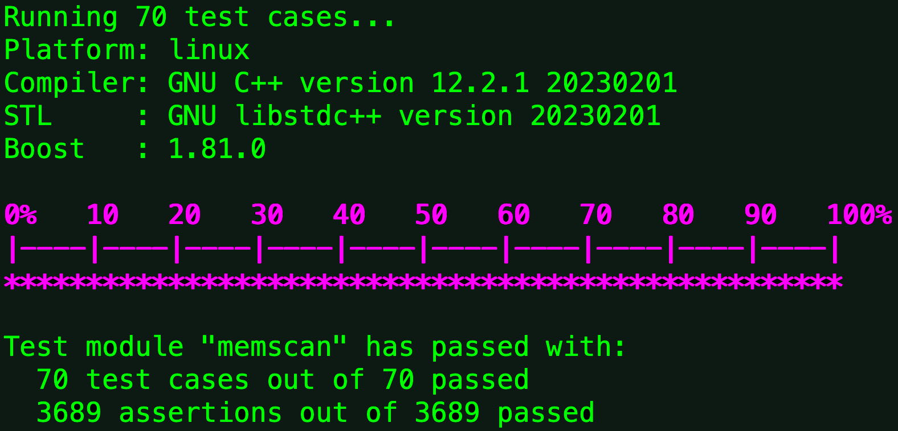

Boost Test
==========


_Test everything that could possibly break_

_The acceptance test makes the customer satisfied that the software provides the
business value that makes them willing to pay for it. The unit test makes the 
programmer satisfied that the software does what the programmer thinks it does._

--[XP] maxims

## The Boost Test Library

The [Boost Test] library provides an easy-to-use and flexible set of interfaces 
for writing tests, organizing them into test cases, and controlling their 
runtime execution.

A typical [Boost Test] looks like this:

    BOOST_AUTO_TEST_SUITE( test_conversions )
       BOOST_AUTO_TEST_CASE( test_Kilo_conversions ) {
          BOOST_CHECK_FAIL( stringToUnsignedLongLongWithScale( NULL ) ) ;
            { char buff[10] =   "0K"  ;  BOOST_CHECK_EQUAL( stringToUnsignedLongLongWithScale( buff ),      0 ) ; }
            { char buff[10] = "  0K " ;  BOOST_CHECK_EQUAL( stringToUnsignedLongLongWithScale( buff ),      0 ) ; }
            { char buff[10] =   "1K"  ;  BOOST_CHECK_EQUAL( stringToUnsignedLongLongWithScale( buff ),   1024 ) ; }
            { char buff[10] = "  1K " ;  BOOST_CHECK_EQUAL( stringToUnsignedLongLongWithScale( buff ),   1024 ) ; }
            { char buff[10] =  "10K"  ;  BOOST_CHECK_EQUAL( stringToUnsignedLongLongWithScale( buff ),  10240 ) ; }
            { char buff[10] = " 10K " ;  BOOST_CHECK_EQUAL( stringToUnsignedLongLongWithScale( buff ),  10240 ) ; }
            { char buff[10] = "100K"  ;  BOOST_CHECK_EQUAL( stringToUnsignedLongLongWithScale( buff ), 102400 ) ; }
       }
    
    BOOST_AUTO_TEST_SUITE_END()

Running [Boost Test] from this command line:
````
    ./boost_tests --build_info --color_output --show_progress --report_format=HRF --report_level=short
````
...generates the following results:



[Boost Test]s are relatively easy to configure and run.  They are incredibly 
powerful when you combine them with an IDE like [Eclipse] or [CLion].

## Integration with CLion

It's easy to add [Boost Test] support to [CLion].  Instead of giving you 
step-by-step instructions, It's best you get directions directly from the source. 
See: https://www.jetbrains.com/help/clion/boost-test-support.html

[Boost Test]: https://www.boost.org/doc/libs/1_82_0/libs/test/doc/html/index.html
[XP]: http://www.extremeprogramming.org
[Eclipse]: https://www.eclipse.org/ide/
[CLion]: https://www.jetbrains.com/clion/
