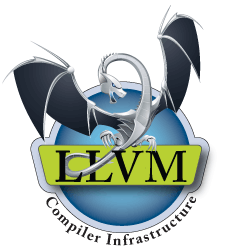

Credits
=======

I'd like to thank Jim Garlic for allowing Empire on our AT&T 3B5 system at CSU 
Chico in the mid-80s.  This was my introduction to the game.

## Toolchain
This project is the product of a tremendous amount of R&D and would not be possible without the following world-class tools:

| Tool           | Website                    |                                                      Logo                                                      |
|----------------|----------------------------|:--------------------------------------------------------------------------------------------------------------:|
| **gcc**        | https://gcc.gnu.org        |                 |
| **llvm/clang** | https://clang.llvm.org     |              |
| **Boost**      | https://boost.org          |             |
| **Doxygen**    | https://doxygen.nl         |         |
| **DOT**        | https://graphviz.org       |                 |
| **Git**        | https://git-scm.com        |                 |
| **GitHub**     | https://github.com         |           |
| **Linux**      | https://kernel.org         |             |
| **ArchLinux**  | https://archlinux.org      |     |
| **VirtualBox** | https://www.virtualbox.org |  |
| **Valgrind**   | https://valgrind.org       |       |

## Abridged from the Wolfpack Empire site

This is a list of known contributors to Empire (either in coding, testing, 
ideas or moral support. :) ).  [It was originally derived from here].

Empire is based on a game written in the late 70s/early 80s by Peter Langston. 
Since he wouldn't distribute the source code, a large reverse engineering/re-coding 
project was undertaken to create a new version of this game and make the source 
available for all.  Since that time, the Empire code has changed drastically and 
been re-written numerous times, and none of that original code exists (other 
than in fond memories) in this code base anymore.

There have been various "stages" of Empire development. At this point in time 
(2003) there have been 5 major stages identified, each with a leading author. 
They are as follows (with successive projects building on the projects before it):
  - Dave Pare (mr-frog@smarttouch.com) (UCSD/BSD)
  - Jeff Bailey (bailey@mcs.kent.edu) (KSU (1.04) Distribution of BSD)
  - Thomas Ruschak (ts@ecn.purdue.edu) (Chainsaw)
  - Ken Stevens (KStevens@GlobeandMail.ca) (3.0.x)
  - Steve McClure (ionica@wolfpackempire.com) (Wolfpack)
    - Jim Simmons (Took over Wolfpack after Steve)
    - Geoff Cashman (Took over Wolfpack after Jim)

It is due to these above people pulling projects together that the Empire server 
has gotten to where it is today.

The people below are recognized as having either given code to the above authors, 
submitted patches, helped on various aspects of the projects (such as info pages), 
play tested, submitted bug reports, bounced ideas, etc.  We are sure that the 
list below is most likely incomplete, and anyone who doesn't see your name on 
the below list, don't be offended.

  - James Anderson (jwa@k.cs.cmu.edu)
  - Jeff Anton (anton@postgres.berkeley.edu)
  - Markus Armbruster
  - Jeff Bailey (bailey@mcs.kent.edu)
  - Mark Ballinger
  - Jan van Beethoven
  - Paul Byrne
  - Geoff Cashman
  - Bill Canning
  - Trannie Carter
  - Sean Casey
  - David Davis
  - Aaron Dewell (dewell@greatland.net)
  - Jorge Diaz
  - Drake Diedrich (Drake.Diedrich@anu.edu.au)
  - Yaser Doleh
  - Ed Down
  - Phill Everson (everson@compsci.bristol.ac.uk)
  - Scott Ferguson
  - Robert Forsman (thoth@beach.cis.ufl.edu)
  - Bill Frolick
  - Steven Grady
  - Keith Graham
  - Jim Griffith (griffith@scam.Berkeley.EDU)
  - Steven Grimm (koreth@ucscb.UCSC.EDU)
  - Karl Hagen
  - Doug Hay (Doug_Hay@tsb.ca)
  - Ken Huisman
  - Lewis R. Jansen (lrj@helios.tn.cornell.edu)
  - Mike St. Johns (stjohns@edn-vax.arpa)
  - Beorn Johnson
  - William S. Kaster
  - Jeremy Kennebel
  - Kevin Klemmick
  - Ron Kuris (rk@unify.com)
  - Nick Lai (lai@cs.ucla.edu)
  - Phil Lapsley
  - Curtis Larsen
  - Robert A. Larson (blarson@skat.usc.edu)
  - Jonathan Lee
  - Craig Leres
  - Dan Logcher (dan@i-kinetics.com)
  - Pat Loney (overlord@wolfpackempire.com)
  - Shelley Louie (slouie@cory.berekely.edu)
  - Steve McClure (ionica@wolfpackempire.com)
  - Chris Metcalf (metcalf-christopher@yale.arpa)
  - Sasha Mikheev
  - Kevin Morgan
  - Richard Moss
  - Keith Muller (muller@sdcc7.ucsd.edu)
  - Chuck Musciano (chuck@trantor.harris-atd.com)
  - Dave Nye
  - Kevin O'Connor
  - Jeff Okamoto
  - Julian Onions (jpo@computer-science.nottingham.ac.uk)
  - Jim Ortlieb
  - Dave Pare (mr-frog@smarttouch.com)
  - Gregory Paris
  - Kurt Pires (kjpires@ic.berkeley.edu)
  - Brett Reid
  - Bernhard Reiter (breiter@mathematik.Uni-Osnabrueck.DE)
  - Jim Reuter (reuter@decwrl.dec.com)
  - James Risner (risner@akira.stdio.com)
  - Thomas Ruschak (ts@ecn.purdue.edu)
  - Edward M. Rynes
  - David Muir Sharnoff (muir@cogsci.berkeley.edu)
  - Alex Shatsky
  - Walter Smith
  - Ken Stevens (KStevens@GlobeandMail.ca)
  - Michael Straub
  - Tom Tedrick
  - Sam Tetherow
  - Yannick Tremblay (yt1@eng.cam.ac.uk)
  - Janjaap van Velthooven
  - Ville Virrankoski
  - Peter Vukovich (peterv@monet.berkeley.edu)
  - Jeff Wallace (jeffw@scam.berkeley.edu)
  - Sverker Wiberg
  - Mike Wise
  - John Yockey (johny@verinet.com)
  - Chad Zabel

[It was originally derived from here]: http://www.wolfpackempire.com/credits.html
